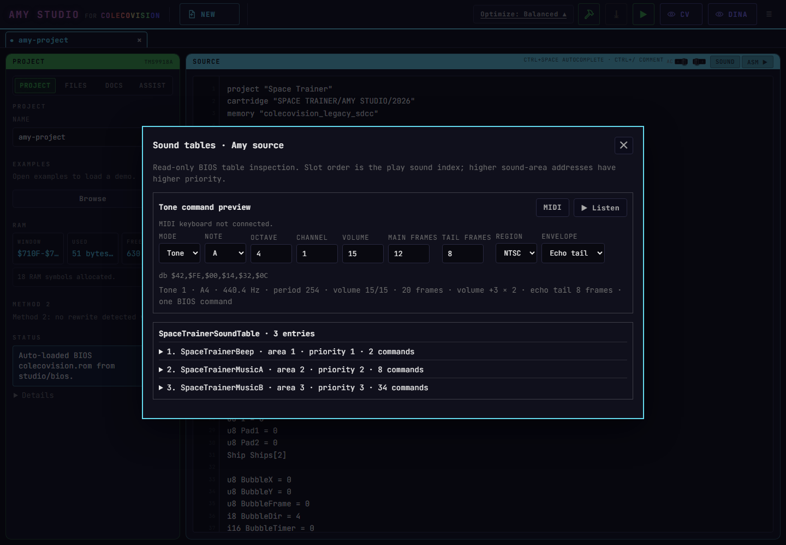

# Amy Studio Tools Gallery

This guide answers three questions for every user-facing tool: where it is, what it does, and what must be checked before trusting its output. Screenshots belong here only after the documented path has been tested in the current Studio build.

## Source And Build

| Tool | Open it | Purpose |
| --- | --- | --- |
| Examples | `PROJECT` > `Browse` | Open a catalogued Amy project without discarding another open project. |
| Source editor | Main `SOURCE` panel | Edit Amy code with syntax colors, autocomplete, comments, and breakpoint gutters. |
| Sound-table inspector | `SOURCE` > `SOUND` | Decode BIOS sound-table slots, area priority, commands, notes, rests, envelopes, and shared tails. |
| Generated assembly | `SOURCE` > `ASM` | Inspect the Z80 emitted by the transpiler and selected optimizer profile. |
| Compile ROM | Top toolbar compile icon | Build the active project and retain its ROM while switching project tabs. |
| ROM Test & Debug | Top toolbar run/debug icon | Run the compiled ROM, inspect execution, use breakpoints, rewind, controls, and disassembly. |

The sound inspector explains each table entry and opens a focused sequence editor. Its numbered rows match `play sound N`; its area address reports BIOS priority and is not a second sound index.

### BIOS Sound Inspector

Open an Amy source containing sound-table declarations, then choose `SOURCE` > `SOUND`.

This capture verifies that the inspector fits at 1440x1000 and keeps its close control visible. A separate 1280x720 check verifies vertical scrolling when a source contains more entries than fit in the window.

To reproduce it, open `PROJECT` > `Browse` > `Space Trainer`, then choose `SOURCE` > `SOUND`. Music-box projects also expose their included ASM sound files from `FILES`.

The command preview offers `Steady`, `Fade out`, and `Echo tail`. Echo tail holds the main volume, then drops by about 6 dB for the remaining frames. It uses one six-byte BIOS command when the main section is at most 16 frames; the tool rejects larger values rather than silently emitting a different effect.

Choose `MIDI` to authorize a connected keyboard through Web MIDI. Note On selects note, octave and velocity; Note Off converts the held time to PAL/NTSC frames, updates the BIOS command, then auditions it. MIDI requires HTTPS or localhost and browser permission. Durations saturate at 256 frames, or 16 main frames for a one-command `Echo tail`.

Expand a sound and choose `Edit sequence`. Compose a command, select its insertion point, then use `+ Add` as often as needed. The timeline shows each command's start frame. `End` stops playback; `Repeat` loops. `Record MIDI` appends each released note with its held duration. Commands can also be duplicated, reordered, auditioned, and saved to Amy source or embedded ASM. Shared tails remain byte-exact, and invalid terminal placement is rejected.

Tiny Sound entries show their tempo, instrument, musical notes, sustain, silence, special commands, and loop instead of the misleading single `Tiny` command. `Listen Tiny channel` auditions one channel; matching `_ch1` and `_ch2` labels also offer `Listen Tiny pair`. Tiny data remains read-only while its full historical format receives round-trip coverage.

## Project Files

Open `FILES` to reach tools attached to individual project resources.

| Resource | Action | Purpose |
| --- | --- | --- |
| `.amy.json`, legacy `.json`, `.gz` | Drop on Studio or use project import | Restore a complete project; recognized legacy exports remain accepted. |
| Text, ASM, INC, JSON | Edit icon | Edit a project file without extracting it from the project. |
| `editors.json` | Edit icon or burger menu `Graphics Editors` | Define which source blocks and files form each graphical editor. |
| Bitmap pattern/color pair | Preview eye, then edit icon | Preview or edit a TMS9918 Graphics II bitmap. |
| Charset or tile data | Tile editor icon | Edit patterns and colors while respecting TMS9918 row-color rules. |
| Sprite patterns | Sprite editor icon | Edit 8x8 or 16x16 patterns, animation frames, and configured layered previews. |
| Metatiles and frames | Configured graphics editor | Edit objects made from multiple character tiles rather than a whole screen. |
| Tilemaps and level screens | Configured graphics editor | Edit a NAME-table map with its declared charset and colors. |
| `.dsound` | Audio action | Preview digitized sound data and inspect its playback settings. |
| Sound ASM/INC | Sound inspection action | Decode supported Coleco BIOS sound tables stored outside the Amy source. |

## Graphics Import

Open the main burger menu, then choose the graphics or picture import workflow.

| Input | Result |
| --- | --- |
| PNG, BMP, GIF and browser-supported images | Convert artwork to legal TMS9918 pattern/color/name data. |
| `.sc2` | Import a Graphics II screen as pattern and color tables. |
| `.pc` | Import paired Coleco/MSX pattern and color data when the file structure is recognized. |
| Existing project bitmap files | Preview first, then open the bitmap editor from `FILES`. |

The importer shows codec choices and must compare both compressed payload and required decompressor cost. A smaller compressed file does not necessarily produce a smaller ROM.

## Compression

The picture/resource import dialog compares the codecs bundled by the current Studio build. Use its result for the current asset; use the Comparison page for cross-tool evidence.

- Verify round-trip equality before accepting a lossless candidate.
- Compare payload plus decompressor size when a project does not already use that codec.
- Prefer an already-linked decompressor when two candidates are close.
- Keep `nmi off` around long direct-to-VRAM decompression phases; the decompressor does not silently own NMI state.

## Audio

| Tool | Open it | Purpose |
| --- | --- | --- |
| BIOS sound inspector | `SOURCE` > `SOUND`, or sound action in `FILES` | Inspect and safely edit one sound-label sequence. |
| Tone preview | Top of the sound inspector | Generate one legal tone, bass, or noise command for comparison and authoring. |
| WAV to DSOUND | Burger menu audio workflow | Convert sampled WAV audio into ColecoVision digitized playback data. |
| DSOUND preview | `.dsound` file action | Listen to the encoded sample before compiling it into a ROM. |

BIOS music/sound tables and DSOUND solve different problems. DSOUND is sampled playback; BIOS tables are compact tone/noise command streams suitable for game music and effects.

## Published Examples To Use

These examples are included in the clean-repo catalog and provide stable starting points:

| Feature | Published example |
| --- | --- |
| BIOS notes, music and sound tables | `Space Trainer`, `Africa Music Box`, `Commando Music Box` |
| DSOUND sampled audio | `DSound Voice Minimal` |
| Bitmap import and compression | `Warrior + Barbarian Slideshow` |
| Layered hardware sprites | `Toolchain Benchmark: Animated Metasprite` |
| Sprite overflow handling | `Sprite Flicker and Stable Layers` |
| Tilemap and puzzle graphics | `Rails Puzzles` |

## Visual QA Checklist

Every screenshot and release check should verify:

- the documented button or menu still exists;
- the intended project/file opens rather than a default replacement;
- the modal fits at 1280x720 and at the normal desktop size;
- long option lists have a visible, usable scrollbar;
- the primary canvas or preview is not clipped by its toolbar;
- controls do not overlap at maximum useful zoom;
- save/cancel/close remain reachable without browser zoom tricks;
- the result survives closing and reopening the project tab;
- generated data compiles and runs in ROM Test & Debug;
- no local absolute path, API key, BIOS, or personal file location appears in documentation or exported projects.

## Current Verification

The source sound inspector has been tested with the complete Quatro Puzzles source. It detects `ExplosionSoundTable` and `TrainTrackSoundTable`, all nine entries, shared priority semantics, command envelopes, rests, and arithmetic addresses such as `$702B+10`. Quatro then compiles and opens through the normal ROM Test & Debug path.

The remaining screenshots are intentionally pending individual UI verification. This prevents the gallery from documenting a dialog that exists in code but is clipped, inaccessible, or unable to save real project data.
