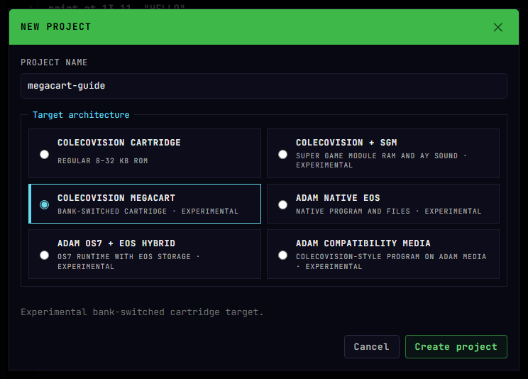
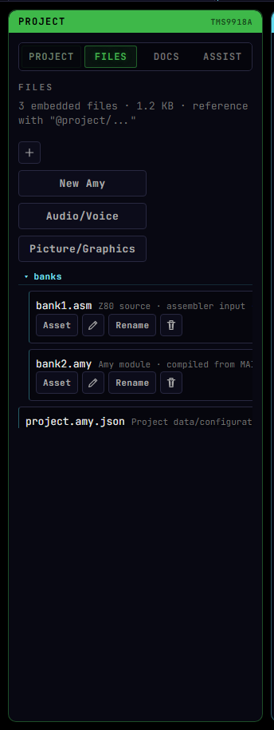
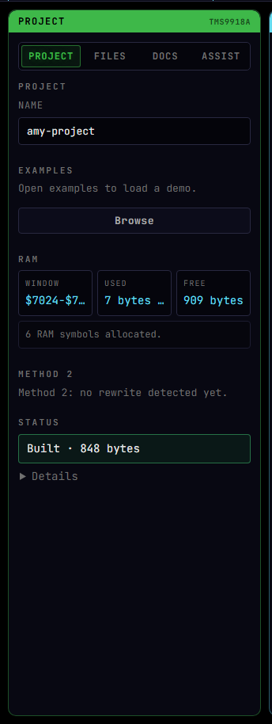
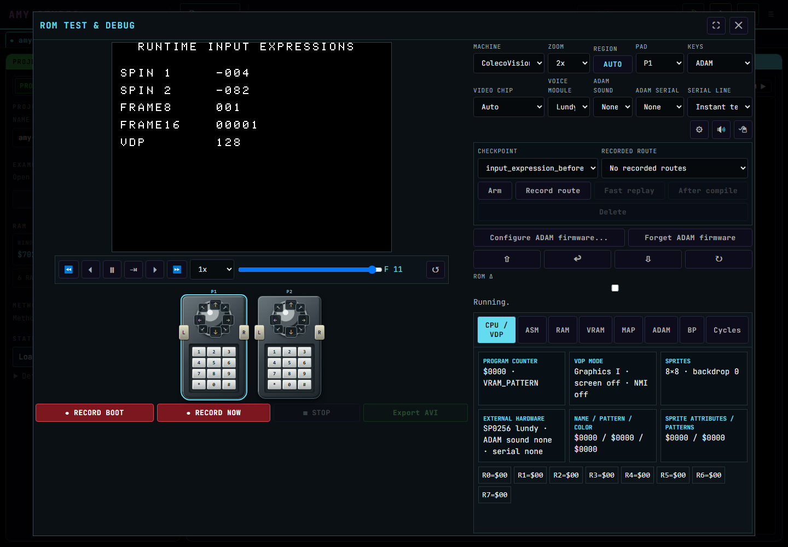

# Amy Studio Workflow

## Goal
Use `studio/index.html` as the main Amy Studio environment for authoring source, generating ASM, building cartridge or ADAM media, managing embedded project assets, and testing the result.

## Steps
1. On Windows, run `tools\serve-studio.cmd`. On macOS/Linux, run `python3 -m http.server 8080` from the repository root.
2. Open `http://localhost:8080/studio/` in your browser.
3. Create or import the correct project target: ColecoVision cartridge, MegaCart, native ADAM EOS, or OS7+EOS hybrid.
4. Write Amy source in the main editor and use the source-file picker for additional editable Amy/ASM/text project files.
5. Optionally add embedded project files in the `Files` tab.
6. Reference embedded files from source with the `@project/...` path prefix.
7. Compile the project; the selected target determines whether Studio builds a ROM/MegaCart image or ADAM DSK/DDP media.
8. Run the compiled output in `Open ROM / Debugger` when behavior, graphics, input, sound, storage, or timing matters.

Compilation validates Amy, emits generated assembly, and assembles the selected project form. Cartridge targets produce ROM output; native and hybrid ADAM targets can produce bootable DSK/DDP media with multiple project files. A successful compile is not proof that the resulting ROM or media boots and behaves correctly.

## Project Targets And Outputs

- `colecovision-cartridge`: normal OS7 cartridge ROM.
- `colecovision-megacart`: banked MegaCart ROM with fixed and switchable 16 KiB regions.
- `adam-eos-application`: native EOS application packaged on DSK or DDP.
- OS7+EOS hybrid: an ADAM boot path that keeps OS7 game compatibility while using selected EOS services.

MegaCart banking and ADAM memory mapping are different hardware contracts. `bank rom` and `bank select` describe cartridge banks; they do not select EOS RAM or firmware mappings. An ADAM project may contain several Amy, ASM, data, and pack files. Select editable sources with the source-file picker above the editor; edits update the project and invalidate its previous build.

### Creating an advanced target

1. Select **New Project**.
2. Choose **ColecoVision MegaCart**, **ADAM Native EOS**, or **ADAM OS7 + EOS Hybrid**.
3. For an ADAM target, choose `.dsk` or `.ddp`; cartridge and MegaCart targets always produce ROM media and therefore hide this selector.
4. Create the project, then open **FILES** to inspect the generated manifest and target-specific sources.
5. Compile once before editing. This establishes the fingerprints used by the FILES build-state indicators.

Select the target card in **New Project**. The media selector appears only for
ADAM targets, because cartridge and MegaCart projects always produce ROM media.



After creation, select **FILES**. The generated tree keeps the fixed program,
switchable banks, and `project.amy.json` manifest visible without crowding the
source-file selector.



A MegaCart starter contains `project.amy.json`, an ASM bank, and a restricted
bank-local Amy file. Native EOS and hybrid starters use their manifest to select
the memory profile and media builder. Do not copy `bank select` into an ADAM
project: MegaCart mapper reads and ADAM MIOC/EOS memory configuration are
different mechanisms.

After a successful build, `COMPILED` means that a file still matches the build,
`MODIFIED` identifies directly edited bytes, and `STALE` identifies an unchanged
textual dependent or declared output that must be rebuilt. Incremental caches
last only for the current Studio session; a page reload gives a clean reference
build.

## Project Import And Export

The preferred exported project name ends in `.amy.json`. Amy Studio also recognizes older `.json` projects by validated content and accepts gzip-compressed `.amy.json.gz` or `.json.gz` projects. Files may be selected through **Import Project** or dropped directly onto the Studio page.

Duplicate browser download names such as `game.amy (1).json` remain importable because recognition is content-based. Import validates the project structure and embedded file data before replacing the active project.

Embedded files are part of the project export. A project does not share its private files with another `.amy.json` project unless those bytes are intentionally copied.

## Project, Files, And Docs Tabs

The left panel is split into:

- `Project`: project name, examples, compile/RAM summaries, and ROM actions
- `Files`: embedded project files, asset snippets, picture previews, and audio/voice import shortcuts
- `Docs`: live Amy language and ColecoVision documentation loaded from the repo, with document selection, reload, and local search

## Compile Status
The status box is intentionally compact. A successful compile reports the ROM
size, symbol count, selected optimization profile, main byte savings, and
whether BIOS previews or emulator actions are available.



Compiler hints are summarized as `Hints: N` in the small status box. Use the
generated ASM/log output when you need the full diagnostic text.

## Debug, Replay, And Recording

Open **ROM / Debugger** after a successful compile. Configure the machine,
firmware, controllers, video chip, and optional hardware in the upper-right
controls. A source statement such as `test checkpoint "input_expression_before"`
appears in the **Checkpoint** selector after compilation.

Select a checkpoint and use **Record route** while playing normally. When the
checkpoint is reached, Amy Studio saves the input path. **Fast replay** returns
to it after a rebuild, and **After compile** performs that replay automatically.
Routes are tied to symbolic checkpoints rather than fragile instruction
addresses.

Use **Record Boot** to reset and capture from the first emulated frame, or
**Record Now** to begin at the current frame. Stop the capture before using
**Export AVI**. The CPU/VDP, ASM, RAM, VRAM, map, ADAM, breakpoint, and cycle
tabs remain available during development.



## Embedded Files
Amy Studio can keep binary and text assets inside the exported `.amy.json` project file instead of requiring a separate disk path at compile time.

Example:

```basic
asset SpeechData from "@project/intro.dsound"
play dsound SpeechData
```

Notes:
- Embedded project files are emitted inline into the generated ASM as `db` bytes.
- Regular filesystem assets still use `incbin` and are unchanged.
- Existing demos and optimizer behavior are not altered unless a project explicitly references `@project/...`.
- The `Files` tab has a direct `Audio/Voice` shortcut to the DSOUND workflow.
- Editable embedded ASM/text files and `editors.json` can be opened directly from `Files`.
- Adding, replacing, editing, or removing a project file invalidates the previous build.
- `codec raw` is implied when the `asset` statement omits a codec.

## Picture Files And Preview
Coleco bitmap pictures are handled as grouped VDP components. Use the same base
name plus a component suffix so Studio can pair the files for preview:

- `Title.pattern.zx0`
- `Title.color.zx0`
- `Title.name.raw` or no name file when the default bitmap name table is fine

The same convention works with other supported codecs, including `.dan2`:

- `CommandoTitle.pattern.dan2`
- `CommandoTitle.color.dan2`

When you import a browser image or a 12288-byte `.pc` picture through the
`Files` tab, Studio converts it to `pattern`/`color` picture components and
opens a compression chooser. The chooser compares each candidate by:

- compressed pattern bytes
- compressed color bytes
- decompressor routine bytes linked on first use
- total first-use ROM cost
- bytes saved versus raw picture data

Use `Best total` when the picture is the only user of that codec. Use
`Smallest data` when the decompressor is already linked elsewhere or when you
are comparing pure asset payload size.

For responsiveness, the first import pass compares raw plus five quick codecs:
`mdkrle`, `nibble`, `bitbuster`, `zx7`, and `dan1`. Use `Compare all codecs` when you want
the slower exhaustive pass, including stronger but slower compressors such as
`zx0`.

Browser image imports first show a preparation step for the image conversion:
`fit`, `cover/crop`, or `stretch`, plus brightness, saturation, and smoothing.
Those controls are applied before the Coleco/TMS9918 palette quantization.
The same step includes a live ColecoVision preview rendered from the generated
`pattern`/`color` tables, not from the original browser image. Contrast and
ordered dithering controls are available there too, so visual tuning happens
before the compression comparison step.

Compression comparison uses browser workers when available. Each non-raw codec
can run in parallel; `raw` is shown immediately. If workers are blocked or not
available, Studio keeps the sequential fallback.

BitBuster note: the JavaScript codec implementation is named `bitbuster12` in
RetroCompress Lite, but Amy source and project files use the simpler
`bitbuster` name.

Typical Amy source:

```basic
picture TitleScreen:
  pattern from "@project/Title.pattern.zx0" codec zx0
  color from "@project/Title.color.zx0" codec zx0
end picture

show picture TitleScreen
```

Use `show picture Name` when you want the all-in-one path: bitmap mode setup,
component upload/decompression, default name-table preparation when needed, and
display enable. Use `upload picture Name` when your program wants to manage
screen state, NMI, sprites, or timing itself.

Preview notes:
- Studio previews pictures by matching a shared base name before `.pattern`,
  `.color`, `.name`, or `.pc`.
- If one half of a pattern/color pair is missing, Studio cannot render the full
  picture preview and the project should be fixed before relying on it.
- Current preview/decompression support covers raw, RLE-family assets, ZX0,
  ZX7, DAN1, DAN2, DAN3, Pletter, LZF, Bitbuster, and compatible `.pc` picture
  files.

## Audio/Voice → DSound
The integrated `Audio/Voice → DSound` tool now supports three workflows:
- load a browser-supported audio file (`.wav`, `.mp3`, `.ogg`, `.m4a`, and similar decodeable formats)
- insert an Amy `data ... end data` block directly into source
- save the generated dsound bytes as an embedded project file for later use with `play dsound`
- record a short microphone clip directly in the browser, then convert that recording to dsound

Recommended dsound workflow:
1. Fastest path:
   - choose an audio file and click `Quick add file to Amy`
   - or record a microphone clip and click `Quick add recording to Amy`
2. Manual path:
   - open `Advanced conversion options`
   - convert first
   - then `Save as project file` or `Save + insert play snippet`
3. If you saved without auto-insert, add the asset line and `play dsound Label` in source.

There is also now a built-in example:
- `DSound Voice Minimal`
  - it ships with a tiny embedded `.dsound` project file so the full asset-based workflow compiles immediately

## Tiny Music Project Files
Converted tiny-music data can also live in the `Files` tab and be referenced
with `@project/...` from an `asset` statement or an included ASM source. Prefer
embedded files for demos that should compile in the browser without a local
filesystem layout.

## ROM Test And Debug

The debugger runs compiled Amy output or external `.rom`, `.col`, `.dsk`, and `.ddp` media. ColecoVision requires a user-supplied 8 KiB BIOS; ADAM mode requires the corresponding user-supplied firmware. Amy Studio does not distribute firmware.

The debugger provides CPU/VDP and ADAMnet inspection, RAM/VRAM views, source and Z80 stepping, breakpoints, watches, cycle profiling, controller configuration, writable ADAM media export, and deterministic recording. In ADAM mode, the `Keys` control routes the computer keyboard to the native ADAM keyboard, joystick port 1, or joystick port 2. `RECORD BOOT` captures from reset; recorded development routes can return quickly to a checkpoint after recompilation.
